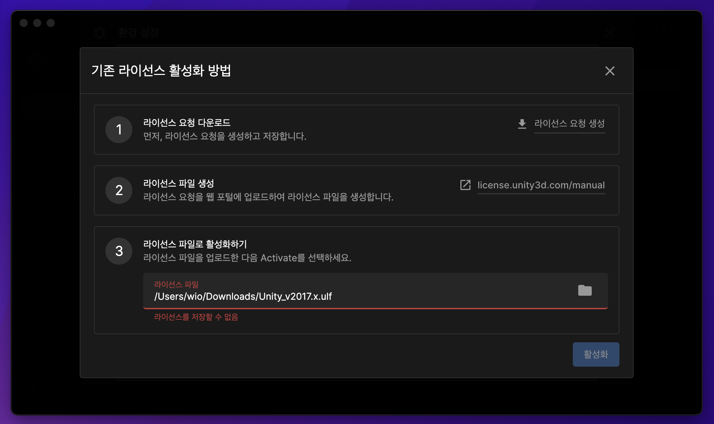

# [MAC]osx 갑자기UNITY실행이 안됨

한2주만에 유니티 공부좀 해볼까 하고 실행을 했는데 "무료 라이선스 활성화가 안됩니다" 라는 문구가 뜨는건 뭥미

5일간 삽질한 결과 해결방을법을 찾았다.

아래 경로를 찾아가 로그 파일을 삭제하고 라이센스를 발급받으면 됨!

윈도우 사용자들도 이런상황이 발생하면 로그파일 경로에서 파일삭제후 재발급 받으면 될듯하다.
